# System workflows

Every workflow in MekanikoMoR, end to end, as implemented. Each section names the files
and functions involved so a workflow can be traced from the UI down to the
domain logic.

- [Architecture at a glance](#architecture-at-a-glance)
- [W0 — Authentication and session](#w0--authentication-and-session)
- [W1 — Bootstrap and hydration](#w1--bootstrap-and-hydration)
- [W2 — PMS evaluation (core engine)](#w2--pms-evaluation-core-engine)
- [W3 — Fleet monitoring](#w3--fleet-monitoring)
- [W4 — Vehicle drill-down](#w4--vehicle-drill-down)
- [W5 — Odometer logging](#w5--odometer-logging)
- [W6 — Work-order lifecycle](#w6--work-order-lifecycle)
- [W7 — Service planning](#w7--service-planning)
- [W8 — Reporting](#w8--reporting)
- [W9 — Search and navigation](#w9--search-and-navigation)
- [W10 — Theming](#w10--theming)
- [W11 — Data reset](#w11--data-reset)
- [W12 — Alerts](#w12--alerts)
- [W13 — Document management](#w13--document-management)
- [W14 — Access control](#w14--access-control)
- [Cross-cutting rules](#cross-cutting-rules)

---

## Architecture at a glance

There is no backend. All state lives in the browser; all maintenance logic is
pure functions over that state.

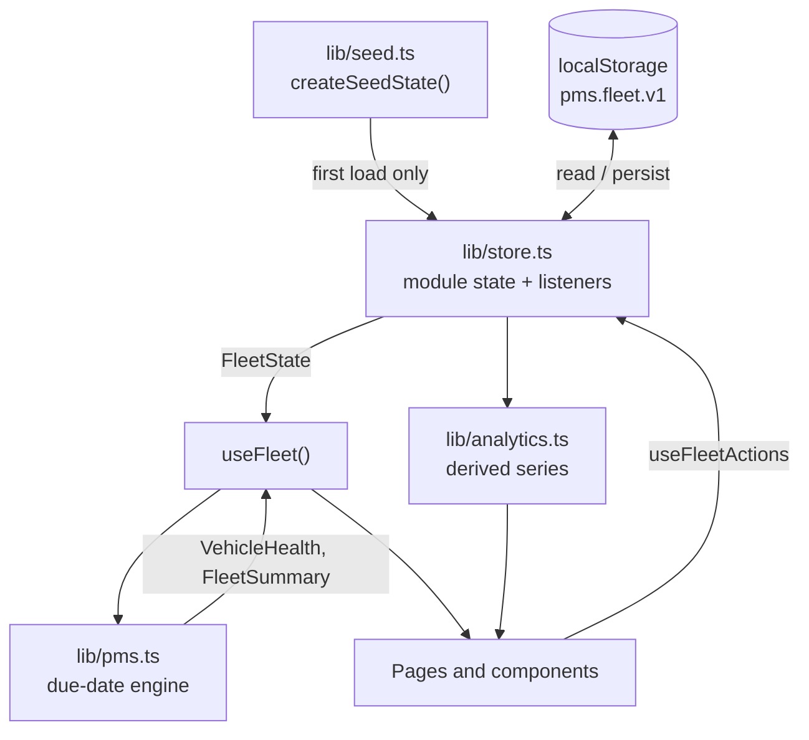

**The one rule that explains the shape of everything else:** a PMS status is a
function of *now*. Rendering it on the server and again on the client would
produce two different answers and break hydration. So the store returns an empty
snapshot on the server, and every page that reads fleet data is a client
component that shows skeletons until `ready` is true.

| Layer | File | Responsibility |
|---|---|---|
| Session | [`lib/auth.ts`](../lib/auth.ts) | Demo sign-in, session record (**not** a security boundary) |
| Permissions | [`lib/rbac.ts`](../lib/rbac.ts) | Capability matrix (**UI affordance**, not enforcement) |
| Alerts | [`lib/alerts.ts`](../lib/alerts.ts) | Derived notifications from mileage, time, and expiry |
| Documents | [`lib/documents.ts`](../lib/documents.ts) | Document kinds, labels, expiry rules |
| Persistence | [`lib/store.ts`](../lib/store.ts) | localStorage, subscriptions, mutations |
| Seed | [`lib/seed.ts`](../lib/seed.ts) | Deterministic demo fleet |
| Domain | [`lib/pms.ts`](../lib/pms.ts) | Due dates, statuses, health scores |
| Catalogue | [`lib/service-tasks.ts`](../lib/service-tasks.ts) | The 12 tracked intervals |
| Derivation | [`lib/analytics.ts`](../lib/analytics.ts) | Cost series, workload, rankings |
| Presentation | `app/(app)/**`, `components/**` | Routes, charts, primitives |

---

## W0 — Authentication and session

> **This is not security.** Credentials are compared in the browser against a
> fixed list in [`lib/auth.ts`](../lib/auth.ts), and the session is a plain
> localStorage record with no token, expiry, or server verification. It exists so
> the login screen has something to do, and anyone can bypass it from devtools.
> Replace the module wholesale when a real identity provider goes in — the rest
> of the app only consumes `useSession()`, `signIn()`, and `signOut()`.

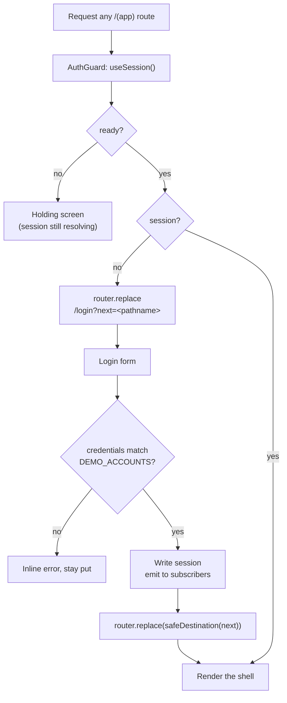

**Three states, not two.** The session snapshot is `undefined` (not yet
hydrated), `null` (hydrated, signed out), or a `Session`. `AuthGuard` must
distinguish the first two or every page load would flash the login screen before
localStorage is read — the same constraint that shapes
[W1](#w1--bootstrap-and-hydration).

**Redirect safety.** `next` comes from the query string and is therefore
attacker-controllable. `safeDestination()` in
[`components/auth/login-form.tsx`](../components/auth/login-form.tsx) accepts
only same-site absolute paths — `//evil.com` and `https://evil.com` both fall
back to `/dashboard` — so the login screen cannot be used as an open redirect.

**Sign-out** clears the record, emits to subscribers, and pushes `/login`. The
fleet data in `pms.fleet.v1` is untouched: signing out is not a data reset (that
is [W11](#w11--data-reset)).

The login route sits outside the `(app)` group, so it renders without the
sidebar and topbar. Its form is server-rendered — `next` arrives as a
`searchParams` prop rather than through `useSearchParams()`, which would force
the Suspense boundary to serve a fallback and flash a skeleton.

---

## W1 — Bootstrap and hydration

Runs once per page load, before any fleet data can be shown.

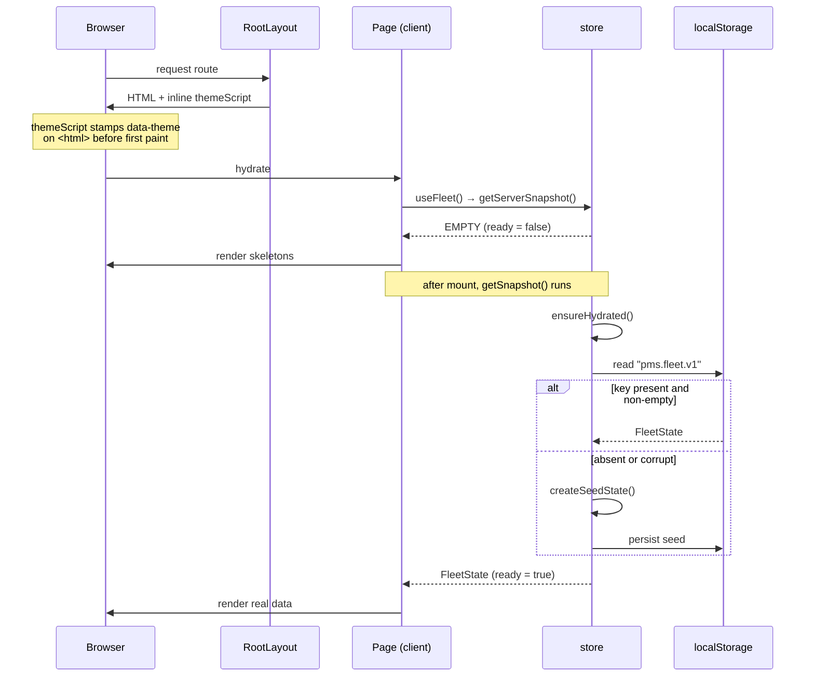

**Steps**

1. `themeScript` in [`components/theme-provider.tsx`](../components/theme-provider.tsx)
   runs synchronously in `<head>`, reading `pms.theme` (defaulting to light) and
   stamping `data-theme` — so there is no flash of the wrong surface.
2. `useFleet()` calls `useSyncExternalStore`. On the server, `getServerSnapshot`
   returns the shared `EMPTY` object.
3. After mount, `getSnapshot` → `ensureHydrated()` reads localStorage once and
   caches the result in module state.
4. A missing, empty, or unparseable key triggers `createSeedState()`, which is
   persisted immediately.
5. `ready` is `snapshot !== EMPTY`. Guard on it before rendering data.

**Seeding.** `createSeedState()` builds 16 vehicles from fixed specs plus a
`mulberry32` PRNG (fixed seeds — the fleet is identical across reloads). Each
vehicle carries a wear profile — `overdue`, `due_soon`, or `healthy` — that
decides how far through its intervals it sits, so the demo shows a realistic
spread rather than being uniformly green or red. Twelve months of completed work
orders are generated with dates drawn *inside each calendar month* (see
[Cross-cutting rules](#cross-cutting-rules)), plus 8 live orders on the board.

---

## W2 — PMS evaluation (core engine)

The heart of the system. Runs inside `useFleet()`'s `useMemo` on every state
change — it is pure, cheap at fleet scale, and never cached across mutations, so
derived health cannot drift from the underlying records.

**Dual limits.** Every task in the catalogue has `intervalKm` *and*
`intervalMonths`. An item is due on **whichever limit arrives first**. Because
one is distance and one is time, the distance limit is projected onto the
calendar using the vehicle's `avgDailyKm` so the two can be compared.

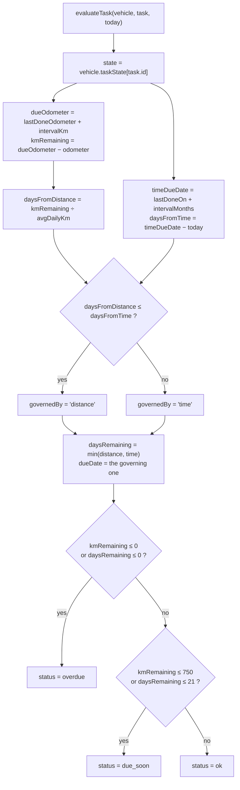

**Thresholds** live in [`lib/pms.ts`](../lib/pms.ts) as `DUE_SOON_KM` (750) and
`DUE_SOON_DAYS` (21). The settings page reads them from there — change them in
one place.

**Progress** is `max(distanceProgress, timeProgress)` and may exceed 1. The
`Meter` component renders anything past 1 as a filled track with a notch rather
than silently pinning at 100%.

### Roll-up

| Function | Input | Output |
|---|---|---|
| `evaluateTask` | vehicle + task | one `PmsItem` |
| `evaluateVehicle` | vehicle | `VehicleHealth` — 12 items sorted by `compareUrgency`, counts, `nextItem`, `healthScore` |
| `evaluateFleet` | vehicles | `VehicleHealth[]` |
| `summariseFleet` | health | `FleetSummary` — the dashboard KPIs |

`compareUrgency` sorts by status rank first (`overdue` → `due_soon` → `ok`), then
by nearest `daysRemaining`.

**Health score** starts at 100 and subtracts per non-compliant item:

| Item state | Safety-critical | Routine |
|---|---|---|
| Overdue | −25 | −15 |
| Due soon | −8 | −4 |

Clamped to 0–100. The weights are deliberately steep: a vehicle carrying two
breached safety intervals must read as a problem, not as a 90-something. Do not
soften them without also revisiting `complianceRate`, or the two figures will
tell contradictory stories on the same screen.

---

## W3 — Fleet monitoring

Route: `/dashboard` — `app/(app)/dashboard/page.tsx`. The default landing view.

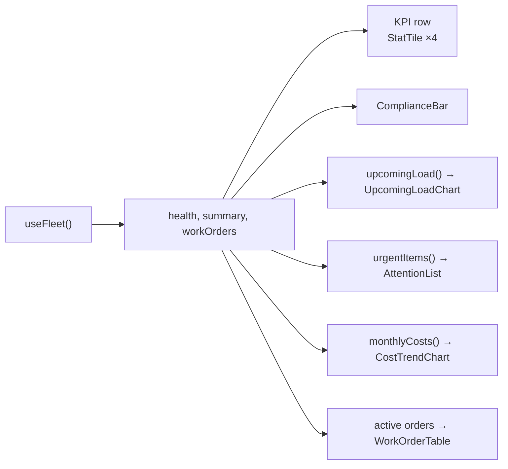

**Reading order**, top to bottom — deliberately the order a fleet manager
triages in:

1. **KPI row** — vehicles in operation, overdue service items, items due within
   21 days (with the estimated cost to clear them via `forecastCost`), and spend
   this month with a 12-point sparkline and a month-over-month delta. Spend uses
   `goodDirection: "down"`, so a rise is coloured as bad.
2. **Compliance bar** — the three PMS states as a segmented meter. Each band
   links to `/vehicles?pms=<state>`, which the vehicles page reads on mount.
3. **Six-week load** — forward workload from `upcomingLoad()`.
4. **Spend trend** — 12 months split into parts and labour.
5. **Needs attention** — every breached or nearly-breached item, fleet-wide,
   most urgent first; each row links to its vehicle.
6. **Active work orders** — everything not `completed` or `cancelled`, soonest
   scheduled first, with inline lifecycle actions.

---

## W4 — Vehicle drill-down

Route: `/vehicles/[vehicleId]` — `app/(app)/vehicles/[vehicleId]/page.tsx`.
Reached from the vehicles list, the attention list, the schedule, work-order
rows, or the command palette.

1. `healthById.get(params.vehicleId)` — a miss renders a "not found" empty state
   rather than throwing, since a stale link is expected.
2. Four summary tiles: health score with meter, odometer, next service due,
   lifetime maintenance spend.
3. Three tabs:
   - **PMS schedule** — all 12 intervals via `PmsSchedule`. Each row shows both
     limits, which one governs, the projected due date, and when it was last
     done, with a per-item **Schedule** button that opens the work-order dialog
     pre-filled with that vehicle and task.
   - **Service history** — every order raised against the unit, newest first.
   - **Vehicle details** — VIN, class, fuel, assignment, registration and
     insurance expiry.

The vehicles index (`app/(app)/vehicles/page.tsx`) filters by
search, PMS state, and department in a single row above the grid, and sorts
**least healthy first** so the list opens on the units that need work.

---

## W5 — Odometer logging

Odometer readings drive every distance-based interval, so this is the smallest
input with the widest blast radius.

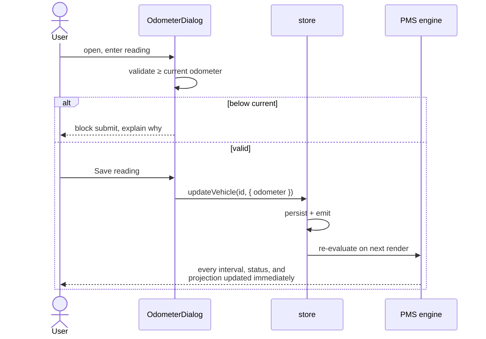

A reading lower than the one on record is rejected — odometers do not run
backwards, and accepting one would silently un-breach intervals.

---

## W6 — Work-order lifecycle

The central operational loop, and the **only** path that resets a PMS clock.

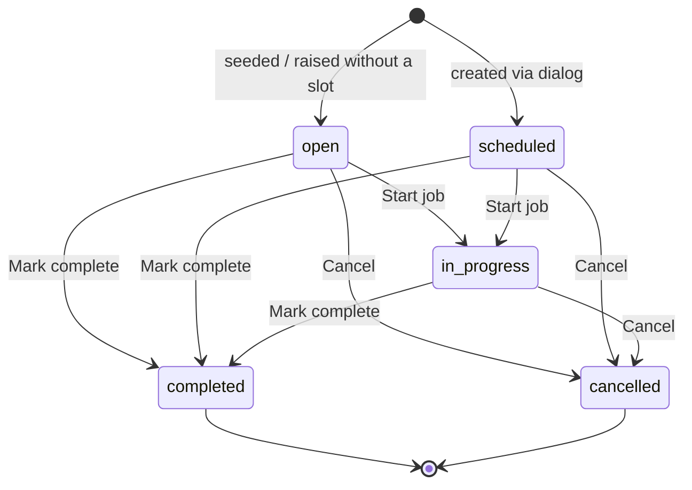

### Raising an order

[`NewWorkOrderDialog`](../components/work-orders/new-work-order-dialog.tsx) is
reachable from the page header of most routes, from a PMS schedule row, and from
a schedule entry. When opened with `vehicleId` / `taskId` props it pre-fills.

- **Preventive / inspection** — pick a catalogue item; title, parts cost
  (`estimatedCost`) and labour (`estimatedHours × ₱650`) are derived from it, and
  `taskIds` carries that task.
- **Corrective** — free-text fault description; `taskIds` is empty, so closing it
  resets no interval.

Submitting calls `createWorkOrder`, which mints an id and a `WO-<year>-<seq>`
reference and prepends the order at status `scheduled`.

### Closing an order

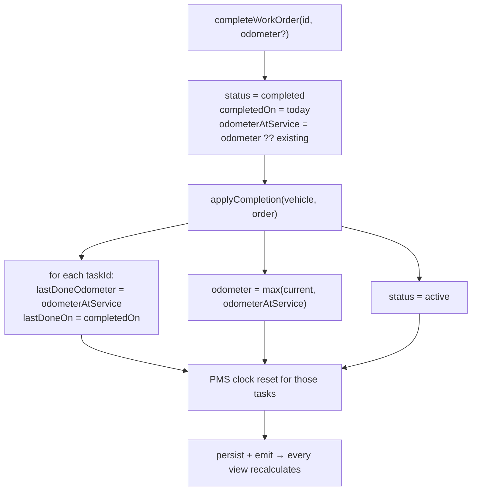

Consequences worth knowing:

- Only tasks in `taskIds` are reset. A corrective repair closes without touching
  any interval — correct, since fixing a compressor is not an oil change.
- Completion returns the vehicle to `active`, taking it out of `in_service`.
- The order now counts toward `monthlyCosts`, `spendByVehicle`, and
  `spendByCategory`; before completion it contributes nothing to spend.

`updateWorkOrder` handles the non-terminal transitions (`in_progress`,
`cancelled`) and never touches vehicle state.

---

## W7 — Service planning

Route: `/schedule` — `app/(app)/schedule/page.tsx`. Answers "what do I need to
book, and how much lead time do I have?"

Every PMS item across the fleet is flattened, filtered by status, sorted by
`compareUrgency`, and bucketed by remaining lead time:

| Group | Condition | Intent |
|---|---|---|
| Overdue | `status === "overdue"` | Book today |
| Next 7 days | `daysRemaining ≤ 7` | Inside the week |
| Next 30 days | `8–30 days` | Enough lead time to order parts |
| Next 90 days | `31–90 days` | Budgeting horizon |

Empty groups are dropped. Each group header totals the estimated cost of
clearing it. Every row carries a **Book in** button that opens the work-order
dialog pre-filled for that vehicle and task — the loop back into
[W6](#w6--work-order-lifecycle).

Above the groups, `upcomingLoad()` charts the next six weeks. Anything already
past its limit collapses into the first bucket: it is work that needs doing now,
not work that is scheduled.

`?status=overdue` deep-links here from the sidebar callout and the topbar bell.

---

## W8 — Reporting

Route: `/reports` — `app/(app)/reports/page.tsx`.

A single period selector (3 / 6 / 12 months) scopes **everything** on the page.
The order set is narrowed once — `scopedOrders`, completed orders whose
`completedOn` month is in range — and every tile and chart reads from it. There
are no per-card filters.

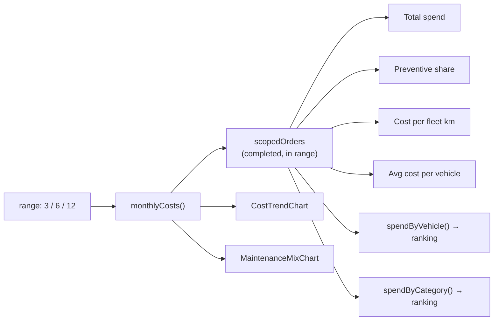

**Preventive share** is the health metric of the whole programme: planned spend
as a proportion of total. It tiles as `ok` at ≥ 60%, `warning` below. The
planned-vs-unplanned line chart is the same story over time — a fleet running its
PMS properly keeps the preventive line above the corrective one.

`spendByVehicle` highlights the costliest unit and greys the rest — emphasis, so
the one number that matters is not buried in eight competing colours.

---

## W9 — Search and navigation

- **Shell** — `app/(app)/layout.tsx` pairs a fixed
  sidebar (desktop) with a sticky topbar. Below `lg`, the sidebar collapses into
  a dialog-based drawer that closes on navigate.
- **Command palette** — `⌘K` / `Ctrl+K`, registered globally by
  `useCommandPalette`. Typing matches vehicles on plate, make, model, assignee,
  and department (top 6), followed by nav destinations. `↑`/`↓` move the cursor,
  `Enter` navigates, and each vehicle row shows its live PMS badge.
- **Standing alerts** — the sidebar shows a persistent overdue callout whenever
  `summary.overdue > 0`; the topbar bell carries a pulse when there is anything
  overdue or due soon. Both link into the schedule.

---

## W10 — Theming

1. `themeScript` runs before paint and stamps `data-theme` from `pms.theme`,
   defaulting to **light**. The OS preference is deliberately not consulted: a
   first-time visitor on a dark-mode machine still lands on the light theme, and
   dark applies only once explicitly chosen.
2. `ThemeProvider` reads that value on mount, so React agrees with the DOM.
3. `setTheme` updates the attribute, `colorScheme`, and localStorage together.
4. Tailwind resolves `darkMode: ["class", '[data-theme="dark"]']`; tokens for
   both modes live in [`app/globals.css`](../app/globals.css).
5. Charts read literal hex from [`lib/chart-theme.ts`](../lib/chart-theme.ts) via
   `useChartColors()` — SVG presentation attributes do not evaluate `var()`, so
   chart colours cannot be CSS custom properties.

Dark chart colours are their own validated steps for the dark surface, not
inverted light ones. Update both columns together.

---

## W11 — Data reset

Settings → **Reset fleet data** → confirmation dialog → `resetFleet()`, which
replaces state with a fresh `createSeedState()` and persists it. Everything the
user logged — raised orders, odometer readings, completions — is discarded. The
dialog says so before the destructive button.

---

## W12 — Alerts

Automated notification on the three things that go stale: service intervals,
booked work, and expiring paperwork.

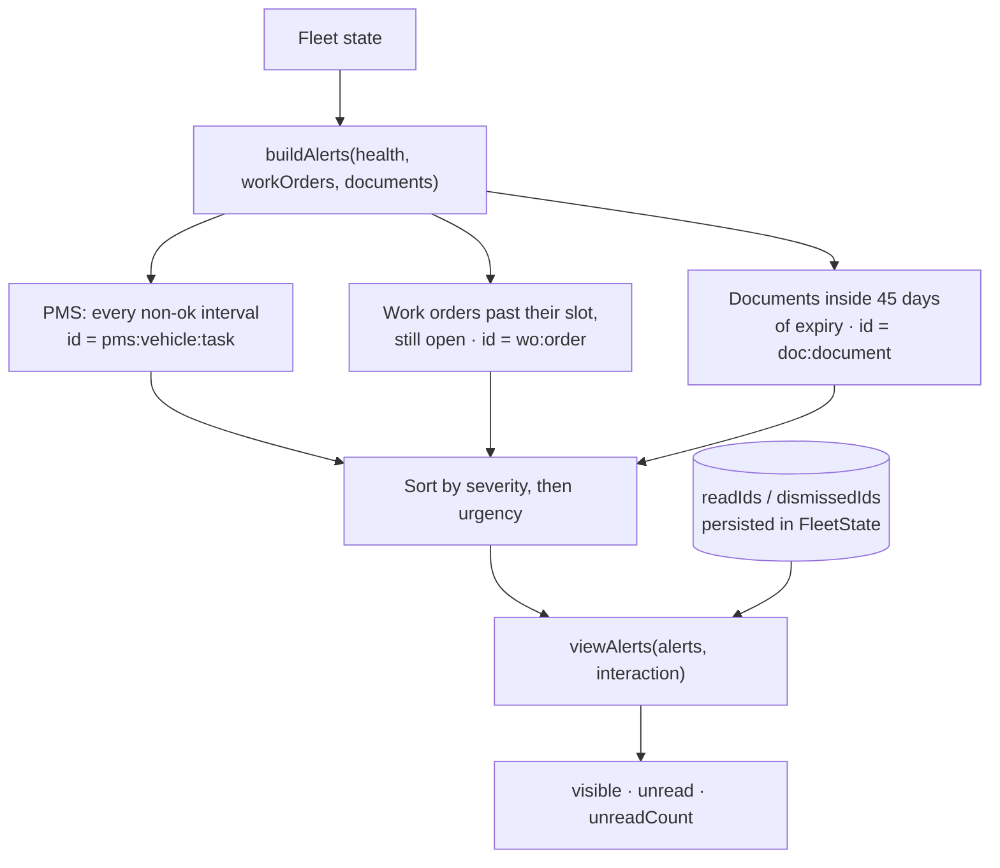

**Derived, never stored.** A stored alert outlives the condition that produced
it — you fix the vehicle and the notification is still there. Recomputing on
every read makes that impossible. Only the *interaction* persists: `readIds` and
`dismissedIds`, keyed by a deterministic id built from the entities involved.

That determinism is load-bearing. If `buildAlerts` produced fresh ids each run,
dismissals would never stick. Anything changing how ids are composed silently
resurrects every dismissed alert.

An alert body always names its trigger — distance remaining, days remaining, and
which limit governs — because "maintenance due" alone tells a fleet manager
nothing about urgency.

**Auto-scheduling** ([`components/work-orders/auto-schedule-dialog.tsx`](../components/work-orders/auto-schedule-dialog.tsx))
closes the loop: it raises a preventive order for every overdue interval not
already covered by a live work order, spreading them over the following days at
three jobs per day. The coverage check makes running it twice a no-op rather
than a double-booking.

---

## W13 — Document management

Route: `/documents` — `app/(app)/documents/page.tsx`. Also surfaced as a tab on
each vehicle and a section on each work order.

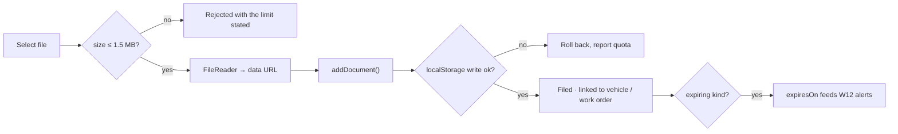

Documents may hang off a vehicle, a work order, both, or neither. Insurance,
registration, and warranty carry an `expiresOn` that feeds the expiry alerts;
other kinds don't offer the field at all, since an expiry date on an invoice
would only generate noise.

**Storage is the constraint.** Files become data URLs inside the same
localStorage record as the fleet, so a single large PDF could exhaust the origin
quota and take all fleet state with it. Two defences: a hard size cap, and
`setStateChecked`, which rolls memory back to the previous state if the write is
rejected rather than leaving storage and memory disagreeing. A real deployment
posts to object storage and keeps only the key.

Seeded documents carry `dataUrl: null` — metadata standing for files held
elsewhere. The list disables download on those and says why, rather than
offering a button that does nothing.

---

## W14 — Access control

> **This is a UI affordance, not a security control.** Capabilities are checked
> in the browser, so devtools defeats them. Their job is to keep people out of
> actions that aren't theirs and to make the permission model legible. Any real
> deployment must mirror [`lib/rbac.ts`](../lib/rbac.ts) on the server and treat
> the client copy as a hint. The `/access` page states this on-screen too.

Four roles, eight capabilities:

| Capability | Fleet Manager | Operations | Technician | Viewer |
|---|:--:|:--:|:--:|:--:|
| `vehicle:update` | ● | ● | ● | |
| `workorder:create` | ● | ● | | |
| `workorder:update` | ● | ● | ● | |
| `workorder:complete` | ● | ● | ● | |
| `document:upload` | ● | ● | ● | |
| `document:delete` | ● | | | |
| `settings:manage` | ● | | | |
| `access:manage` | | | | |

**Gating happens inside the action components**, not at call sites —
`NewWorkOrderDialog`, `OdometerDialog`, and `UploadDocumentDialog` each check
their own capability and render a `DeniedAction` when it's absent. A new screen
that drops one of these in inherits the gate automatically and cannot forget it.

`DeniedAction` dims the control and explains the denial on hover rather than
hiding it. A missing button reads as a broken app; a disabled one with a reason
teaches the permission model.

---

## Cross-cutting rules

**State propagation.** Every mutation goes through `setState`, which updates
module state, writes to localStorage, and calls every subscriber. There is no
partial invalidation: `useFleet()` recomputes the whole engine from the new
snapshot. Storage failures (quota, private mode) are swallowed — the in-memory
copy still drives the session.

**Dates.** Seed history is drawn *inside each calendar month* rather than by
30-day arithmetic. The naive version pushed most of the current month into the
previous bucket and left the dashboard's headline tile reading ₱0 with a −100%
delta. Volume in the current month is scaled to the elapsed fraction.

**Schema migration.** `normalise()` in [`lib/store.ts`](../lib/store.ts) brings
stored payloads up to the current shape on read. Records written before parts,
findings, documents, or alert state existed are still in people's browsers;
without it, reading `order.parts.length` throws on their first load. Any new
required field on a persisted type needs a default added there.

**Costs.** Read parts cost through `resolvePartsCost`, never `order.partsCost`
directly. Estimates and seeded history carry only the aggregate; once a
technician itemises the parts, the lines are authoritative. Reading the raw
field makes cost reports disagree with the service record they're derived from.

**Invariants** that must hold for the UI to be truthful:

- A vehicle's `lastDoneOdometer` never exceeds its current `odometer`.
- Interval progress is never negative.
- A `completed` order always has a `completedOn` date.
- Every vehicle carries all 12 tracked intervals.
- The fleet is never uniformly compliant or uniformly overdue — both extremes
  make the dashboard useless as a demonstration.
- A completed order's itemised parts total equals its `partsCost`.
- Alert ids are unique and deterministic across rebuilds.
- No document references a vehicle or work order that doesn't exist.
- Every capability the UI checks is granted to at least one role.

**Extension points**

| Goal | Change |
|---|---|
| Real backend | Replace [`lib/store.ts`](../lib/store.ts). Nothing else knows the source. |
| Different intervals | Edit `SERVICE_TASKS` in [`lib/service-tasks.ts`](../lib/service-tasks.ts). |
| Different warning bands | `DUE_SOON_KM` / `DUE_SOON_DAYS` in [`lib/pms.ts`](../lib/pms.ts). |
| Per-vehicle schedules | `evaluateVehicle` currently maps over the global catalogue; give `Vehicle` its own task list and map over that. |
| Telematics odometers | Feed `updateVehicle(id, { odometer })`; the rest of W5 is unchanged. |
